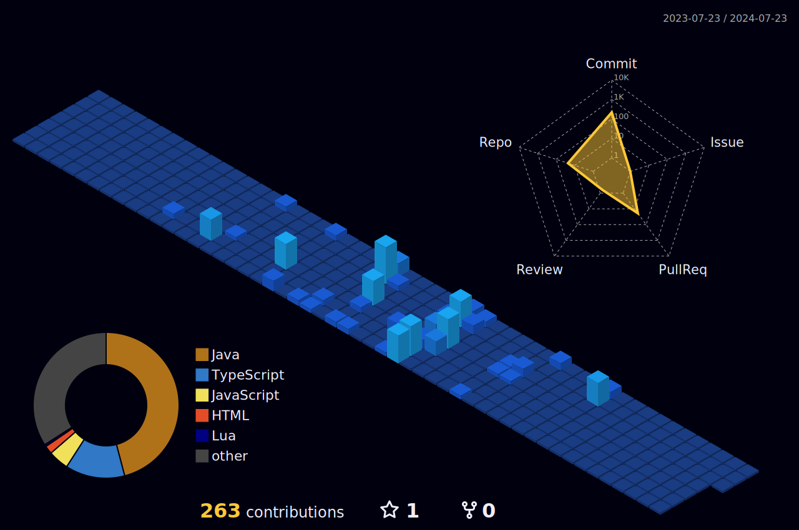

# 💫 About Me:
Hi 👋 I'm Zahid Wazifa, a University of Sriwijaya student studying computer systems who is enthusiastic about technology and its development.  has acquired expertise in Microsoft office, Software  Developmen, cloud computing, DevOps, and Web programming.  enthused about cloud computing and machine intelligence and seeking to have a substantial impact on the tech sector.<br>📫 How to reach me  at zahidwazifa@gmail.com<br>

# 📊 GitHub Stats:
<div align="Center">
  <a href="https://github.com/ZahidWazifa"> 
  
  </a>
  <a href="https://github.com/ZahidWazifa">
    
  </a >
  <a href="https://github.com/ZahidWazifa">
    
<!--   </a>
  <a href="https://github.com/ZahidWazifa">
    
  </a> -->
    <!--START_SECTION:waka-->

```rust
From: 29 March 2024 - To: 31 October 2024

Total Time: 46 hrs 7 mins

Java                  25 hrs 30 mins  ⣿⣿⣿⣿⣿⣿⣿⣿⣿⣿⣿⣿⣿⣷⣀⣀⣀⣀⣀⣀⣀⣀⣀⣀⣀   55.02 %
Python                6 hrs 53 mins   ⣿⣿⣿⣶⣀⣀⣀⣀⣀⣀⣀⣀⣀⣀⣀⣀⣀⣀⣀⣀⣀⣀⣀⣀⣀   14.85 %
SQL                   3 hrs 32 mins   ⣿⣷⣀⣀⣀⣀⣀⣀⣀⣀⣀⣀⣀⣀⣀⣀⣀⣀⣀⣀⣀⣀⣀⣀⣀   07.63 %
PHP                   3 hrs 27 mins   ⣿⣷⣀⣀⣀⣀⣀⣀⣀⣀⣀⣀⣀⣀⣀⣀⣀⣀⣀⣀⣀⣀⣀⣀⣀   07.48 %
Java Properties       1 hr 30 mins    ⣷⣀⣀⣀⣀⣀⣀⣀⣀⣀⣀⣀⣀⣀⣀⣀⣀⣀⣀⣀⣀⣀⣀⣀⣀   03.26 %
XML                   59 mins         ⣦⣀⣀⣀⣀⣀⣀⣀⣀⣀⣀⣀⣀⣀⣀⣀⣀⣀⣀⣀⣀⣀⣀⣀⣀   02.15 %
GitIgnore file        58 mins         ⣦⣀⣀⣀⣀⣀⣀⣀⣀⣀⣀⣀⣀⣀⣀⣀⣀⣀⣀⣀⣀⣀⣀⣀⣀   02.12 %
HTTP Request          48 mins         ⣦⣀⣀⣀⣀⣀⣀⣀⣀⣀⣀⣀⣀⣀⣀⣀⣀⣀⣀⣀⣀⣀⣀⣀⣀   01.75 %
Jupyter               26 mins         ⣄⣀⣀⣀⣀⣀⣀⣀⣀⣀⣀⣀⣀⣀⣀⣀⣀⣀⣀⣀⣀⣀⣀⣀⣀   00.94 %
Properties            21 mins         ⣄⣀⣀⣀⣀⣀⣀⣀⣀⣀⣀⣀⣀⣀⣀⣀⣀⣀⣀⣀⣀⣀⣀⣀⣀   00.78 %
```

<!--END_SECTION:waka-->
</div>
<br>

# 💻 Tech Stack: 


---
![Back End](https://github-readme-tech-stack.vercel.app/api/cards?title=Back+End&borderRadius=5&showBorder=false&lineCount=1&width=550&titleColor=%23AAADC4&line1=MongoDB%2Cmongo+DB%2C005f02%3Bdata%3Aimage%2Fsvg%2Bxml%3Bbase64%2CPHN2ZyB4bWxucz0iaHR0cDovL3d3dy53My5vcmcvMjAwMC9zdmciIHZpZXdCb3g9IjAgMCAyNTUuMzg0IDI1NC4wNTQiPgogIDxkZWZzPgogICAgPGxpbmVhckdyYWRpZW50IGlkPSJhIiB4MT0iMjQuNzE1IiB4Mj0iMTUxLjEzNiIgeTE9IjIyLjg5OCIgeTI9IjE0OC4zMzciIGdyYWRpZW50VHJhbnNmb3JtPSJzY2FsZSguOTk4ODkgMS4wMDExMSkiIGdyYWRpZW50VW5pdHM9InVzZXJTcGFjZU9uVXNlIj4KICAgICAgPHN0b3Agb2Zmc2V0PSIwJSIgc3RvcC1jb2xvcj0iIzM4N0VCOCIvPgogICAgICA8c3RvcCBvZmZzZXQ9IjEwMCUiIHN0b3AtY29sb3I9IiMzNjY5OTQiLz4KICAgIDwvbGluZWFyR3JhZGllbnQ%2BCiAgICA8bGluZWFyR3JhZGllbnQgaWQ9ImIiIHgxPSIxMDIuNDgzIiB4Mj0iMjM4LjI2IiB5MT0iMTAzLjI2NiIgeTI9IjIzMS45MDUiIGdyYWRpZW50VHJhbnNmb3JtPSJzY2FsZSguOTk4ODkgMS4wMDExMSkiIGdyYWRpZW50VW5pdHM9InVzZXJTcGFjZU9uVXNlIj4KICAgICAgPHN0b3Agb2Zmc2V0PSIwJSIgc3RvcC1jb2xvcj0iI0ZGRTA1MiIvPgogICAgICA8c3RvcCBvZmZzZXQ9IjEwMCUiIHN0b3AtY29sb3I9IiNGRkMzMzEiLz4KICAgIDwvbGluZWFyR3JhZGllbnQ%2BCiAgPC9kZWZzPgogIDxwYXRoIGZpbGw9InVybCgjYSkiIGQ9Ik0xMjYuOTE2LjA3MmMtNjQuODMyIDAtNjAuNzg0IDI4LjExNS02MC43ODQgMjguMTE1bC4wNzIgMjkuMTI4aDYxLjg2OHY4Ljc0NUg0MS42MzFTLjE0NSA2MS4zNTUuMTQ1IDEyNi43N2MwIDY1LjQxNyAzNi4yMSA2My4wOTcgMzYuMjEgNjMuMDk3aDIxLjYxdi0zMC4zNTZzLTEuMTY1LTM2LjIxIDM1LjYzMi0zNi4yMWg2MS4zNjJzMzQuNDc1LjU1NyAzNC40NzUtMzMuMzE5VjMzLjk3UzE5NC42Ny4wNzIgMTI2LjkxNi4wNzJ6TTkyLjgwMiAxOS42NmExMS4xMiAxMS4xMiAwIDAgMSAxMS4xMyAxMS4xMyAxMS4xMiAxMS4xMiAwIDAgMS0xMS4xMyAxMS4xMyAxMS4xMiAxMS4xMiAwIDAgMS0xMS4xMy0xMS4xMyAxMS4xMiAxMS4xMiAwIDAgMSAxMS4xMy0xMS4xM3oiIHN0eWxlPSJmaWxsOnVybCgjYSkiIHRyYW5zZm9ybT0idHJhbnNsYXRlKC0uMTQ1IC0uMDcyKSIvPgogIDxwYXRoIGZpbGw9InVybCgjYikiIGQ9Ik0xMjguNzU3IDI1NC4xMjZjNjQuODMyIDAgNjAuNzg0LTI4LjExNSA2MC43ODQtMjguMTE1bC0uMDcyLTI5LjEyN0gxMjcuNnYtOC43NDVoODYuNDQxczQxLjQ4NiA0LjcwNSA0MS40ODYtNjAuNzEyYzAtNjUuNDE2LTM2LjIxLTYzLjA5Ni0zNi4yMS02My4wOTZoLTIxLjYxdjMwLjM1NXMxLjE2NSAzNi4yMS0zNS42MzIgMzYuMjFoLTYxLjM2MnMtMzQuNDc1LS41NTctMzQuNDc1IDMzLjMydjU2LjAxM3MtNS4yMzUgMzMuODk3IDYyLjUxOCAzMy44OTd6bTM0LjExNC0xOS41ODZhMTEuMTIgMTEuMTIgMCAwIDEtMTEuMTMtMTEuMTMgMTEuMTIgMTEuMTIgMCAwIDEgMTEuMTMtMTEuMTMxIDExLjEyIDExLjEyIDAgMCAxIDExLjEzIDExLjEzIDExLjEyIDExLjEyIDAgMCAxLTExLjEzIDExLjEzeiIgc3R5bGU9ImZpbGw6dXJsKCNiKSIgdHJhbnNmb3JtPSJ0cmFuc2xhdGUoLS4xNDUgLS4wNzIpIi8%2BCjwvc3ZnPgo%3D%2Cpython%2C%3Blaravel%2Claravel%2Cff2d20%3B)
---

---


  ## 💰 Support me by Donating
  [](https://paypal.me/ZAHIDWAZIFA) 

